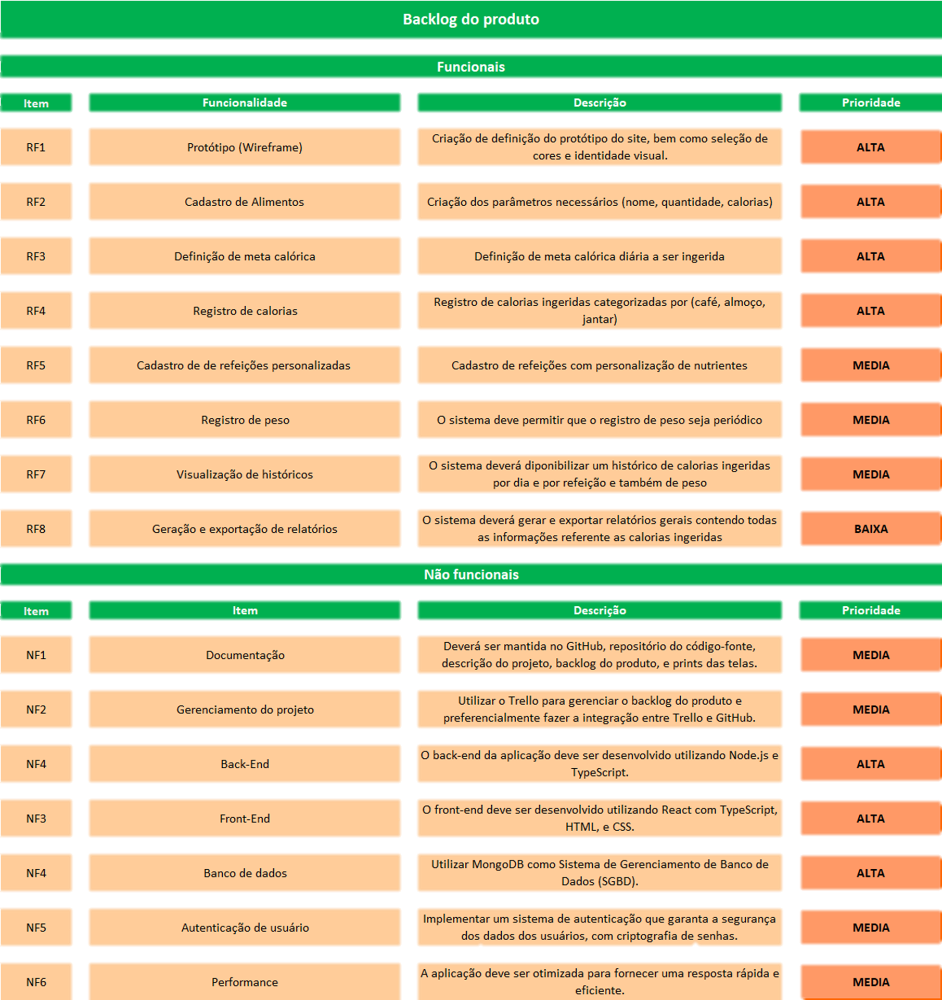
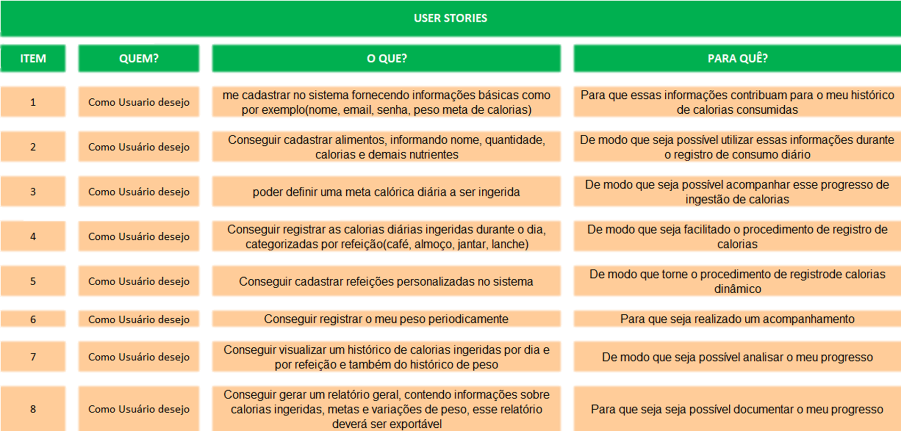

  

  <h1  style="display: flex; justify-content: center; align-items: center; text-align: center; border-bottom: none; margin-bottom: 0;">

   LifePlus Documentação

  </h1>

  

  

  

 

<a  href="#sobre">Sobre o Projeto</a> |
<a  href="#backlogs">Product Backlog</a> |
<a  href="#sprint">Entrega de Sprints</a> |
<a  href="#tecnologias">Tecnologias</a> |
<a  href="#equipe">Nossa Equipe</a> |
<a  href=#useStories> Use Stories</a>

 

  
  

<h2>

📖 Sobre o Projeto :

</h2>

O LifePlus é um projeto desenvolvido por nossa equipe com o objetivo de facilitar o controle de calorias. As principais funcionalidades da plataforma incluem:

 

 

  

- Cadastro de refeições: Permite aos usuários registrar suas refeições e as calorias correspondentes.

- Cadastro de novas comidas: Oferece a opção de adicionar novos alimentos e suas informações nutricionais.

  

- Atualização de dados: Facilita a modificação das informações de refeições e alimentos já cadastrados.

  

- Gráficos de acompanhamento: Fornece visualizações gráficas para ajudar no monitoramento e análise das ingestões diárias de calorias.

  

 

  

O LifePlus visa fornecer uma solução prática e intuitiva para o acompanhamento nutricional e controle dietético.

 

  

##### [🔝 Voltar ao topo ](#topo)

 

  

<h2  id="sprint">

📆 Entregas das Sprints :

</h2>

  

Cada entrega foi realizada a partir da data definida com o cliente, com o relatório completo do que foi desenvolvido nas sprints. Abaixo está a relação das sprints e suas entregas:

| Sprint | Data Entrega | Status | Relatórios |
| ------ | -------------------- | ------ | --------- |
| 1 | 📅 17/09/2024 | :heavy_check_mark: Finalizada | [📍 Ver Relatório](./Sprint01.md) |
| 2 | 📅 08/10/2024 | :heavy_check_mark: Finalizada | [📍 Ver Relatório](./Sprint02.md ) |
| 3 | 📅 08/11/2024 | :x:Em Progresso| [📍 Ver Relatório](./Sprint03.md ) |

  

Legenda:  :heavy_check_mark: **Finalizada** 🚧 **Em Progresso**:x: **Não iniciado**

 

  

##### [🔝 Voltar ao topo ](#topo)

  
  
  

<h2>🧾Backlog do Produto</h2>
<!--IMAGEM DO BACKLOG-->

<h2>👤User Stories</h2>
<!--IMAGEM DO USERSTORIES-->

  

##### [🔝 Voltar ao topo ](#topo)

  
  

<h2>

🧾 Requisitos da aplicação:
  
  Acesse o Desafio e Requistos em pdf, [clicando aqui!](./documentation/Desafio%203DSM%20-%202024.pdf)
  

  

  

  
 
  

  

##### [🔝 Voltar ao topo ](#topo)

  
  

<h2>

  

💻 Tecnologias :

</h2>

 

<a  href="https://www.git.com/">  

 
 
 
 
 
<a  href="">

  

 

  

##### [🔝 Voltar ao topo ](#topo)

  

<h2>

 Nossa quipe :

</h2>

  

  

| Função | Nome | Links |
|-----------------|-------------------------------|-------------------------------------------------------------------------------------------------------------------------------|
| Product Owner | Gustavo Carvalho |   |
| Scrum Master | Guilherme Carvalho |   |
| Dev Team | Caio Cesar Silva Azevedo dos Reis |   |
| Dev Team | Carlos Roberto Torres dos Santos |   |
  
  

  

 

##### [🔝 Voltar ao topo ](#topo)  
