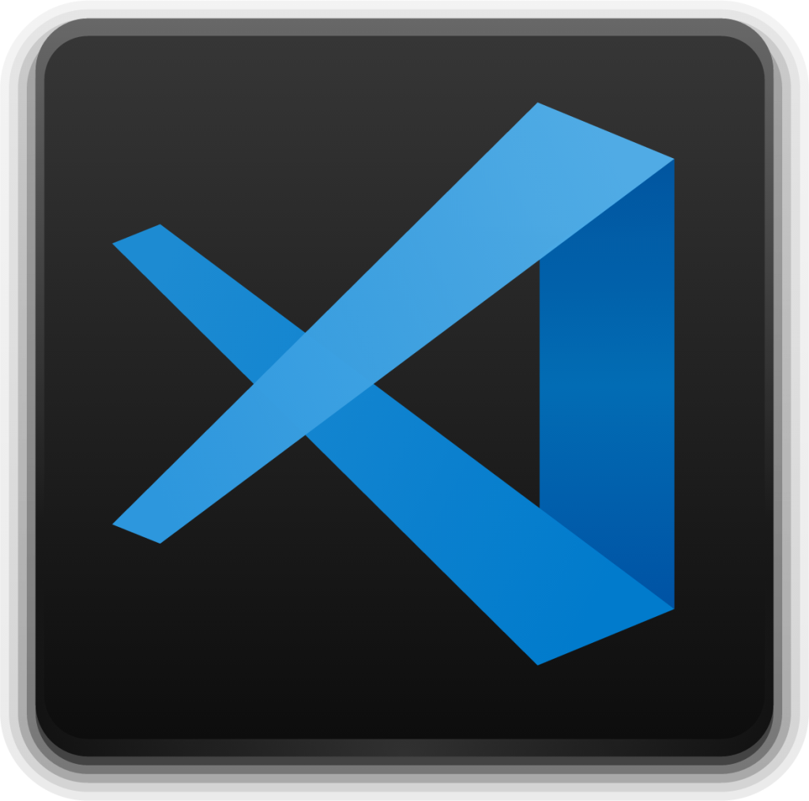

  

  <h1  style="display: flex; justify-content: center; align-items: center; text-align: center; border-bottom: none; margin-bottom: 0;">

   LifePlus-Visona-Documentação

  </h1>

  

  

  

  

 

<a  href="#sobre">Sobre o Projeto</a> |
<a  href="#backlogs">Product Backlog</a> |
<a  href="#sprint">Entrega de Sprints</a> |
<a  href="#tecnologias">Tecnologias</a> |
<a  href="#equipe">Nossa Equipe</a> |
<a  href=#useStories> Use Stories</a>

  

 

  
  

<h2>

📖 Sobre o Projeto :

</h2>

O LifePlus é um projeto desenvolvido por nossa equipe com o objetivo de facilitar o controle de calorias. As principais funcionalidades da plataforma incluem:

 

 

  

- Cadastro de refeições: Permite aos usuários registrar suas refeições e as calorias correspondentes.

- Cadastro de novas comidas: Oferece a opção de adicionar novos alimentos e suas informações nutricionais.

  

- Atualização de dados: Facilita a modificação das informações de refeições e alimentos já cadastrados.

  

- Gráficos de acompanhamento: Fornece visualizações gráficas para ajudar no monitoramento e análise das ingestões diárias de calorias.

  

 

  

O LifePlus visa fornecer uma solução prática e intuitiva para o acompanhamento nutricional e controle dietético.

 

  

##### [🔝 Voltar ao topo ](#topo)

 

  

<h2  id="sprint">

📆 Entregas das Sprints :

</h2>

  

Cada entrega foi realizada a partir da data definida com o cliente, com o relatório completo do que foi desenvolvido nas sprints. Abaixo está a relação das sprints e suas entregas:

| Sprint | Data Entrega | Status | Relatórios |
| ------ | -------------------- | ------ | --------- |
| 1 | 📅 17/09/2024 | :heavy_check_mark: Finalizada | [📍 Ver Relatório](./Sprint01.md ) |
| 2 | 📅 08/10/2024 | :heavy_check_mark: Finalizada | [📍 Ver Relatório](./Sprint02.md ) |
| 3 | 📅 08/11/2024 | :heavy_check_mark: Finalizada | [📍 Ver Relatório](./Sprint03.md ) |

  

Legenda:  :heavy_check_mark: **Finalizada** 🚧 **Em Progresso**:x: **Não iniciado**

  

 

  

##### [🔝 Voltar ao topo ](#topo)

  
  
  

<h2>

📑 Product Backlog :

</h2>

  

 

  

##### [🔝 Voltar ao topo ](#topo)

  
  

<h2>

🧾 Requisitos da aplicação:

</h2>

Acesse o Desafio e Requistos em pdf, [clicando aqui!](./documentation/Desafio%203DSM%20-%202024.pdf)

  

<h3>Requisitos funcionais :</h3>

  

-  **RF01 - Cadastro de Usuário:**

- O sistema deve permitir o cadastro de usuários com informações básicas (nome, email, senha, peso, meta de calorias, etc.).

  

-  **RF02 - Cadastro de Comidas:**

- O usuário deve ser capaz de cadastrar alimentos, informando nome, quantidade (porção), calorias, e outros nutrientes relevantes.

  

-  **RF03 - Definição de Meta Calórica Diária:**

- O usuário deve poder definir uma meta calórica diária a ser ingerida.

  

-  **RF04 - Registro de Calorias Consumidas:**

- O usuário deve poder registrar as calorias ingeridas durante o dia, categorizadas por refeição (café da manhã, almoço, jantar, lanche, etc.).

  

-  **RF05 - Cadastro de Refeições:**

- O sistema deve permitir o cadastro de refeições personalizadas, além dos padrões já cadastrados (café da manhã, almoço, jantar, lanche).

  

-  **RF06 - Histórico de Peso:**

- O usuário deve poder registrar seu peso periodicamente para acompanhamento.

  

-  **RF07 - Visualização de Histórico:**

- O usuário deve poder visualizar um histórico de calorias ingeridas por dia e por refeição, além do histórico de peso ao longo do tempo.

  

-  **RF08 - Relatórios:**

- O sistema deve gerar um relatório geral contendo informações sobre calorias ingeridas, metas atingidas, e variações de peso. O relatório deve estar disponível para exportação em formato PDF.

  

<h3>Requisitos não funcionais :</h3>

  

-  **RNF01 - Documentação:**

- A documentação do projeto deve ser mantida no GitHub, incluindo o repositório do código-fonte, descrição do projeto, backlog do produto, e prints das telas ou links para o portal.

  

-  **RNF02 - Gerenciamento de Projetos:**

- Utilizar o Trello para gerenciar o backlog do produto e preferencialmente fazer a integração entre Trello e GitHub.

  

-  **RNF03 - Tecnologia Back-end:**

- O back-end da aplicação deve ser desenvolvido utilizando Node.js e TypeScript.

  

-  **RNF04 - Tecnologia Front-end:**

- O front-end deve ser desenvolvido utilizando React com TypeScript, HTML, e CSS.

  

-  **RNF05 - Banco de Dados:**

- Utilizar MongoDB como Sistema de Gerenciamento de Banco de Dados (SGBD).

  

-  **RNF06 - Autenticação de Usuário:**

- Implementar um sistema de autenticação que garanta a segurança dos dados dos usuários, com criptografia de senhas.

  

-  **RNF07 - Performance:**

- A aplicação deve ser otimizada para fornecer uma resposta rápida e eficiente, mesmo com uma grande quantidade de dados de usuários.

  

  

 

  

##### [🔝 Voltar ao topo ](#topo)

  

<h2>

Use Stories :

</h2>

  

 

  

##### [🔝 Voltar ao topo ](#topo)

  
  

<h2>

  

💻 Tecnologias :

</h2>

  

 

<a  href="https://www.git.com/">  

 
 
 
 
 
<a  href="">

  

 

  

##### [🔝 Voltar ao topo ](#topo)

  

<h2>

 Nossa quipe :

</h2>

  

  

| Função | Nome | Links |
|-----------------|-------------------------------|-------------------------------------------------------------------------------------------------------------------------------|
| Product Owner | Gustavo Carvalho |   |
| Scrum Master | Guilherme Carvalho |   |
| Dev Team | Caio Cesar Silva Azevedo dos Reis |   |
| Dev Team | Lucas Braz Dias |   |

  
  

  

 

##### [🔝 Voltar ao topo ](#topo)  
