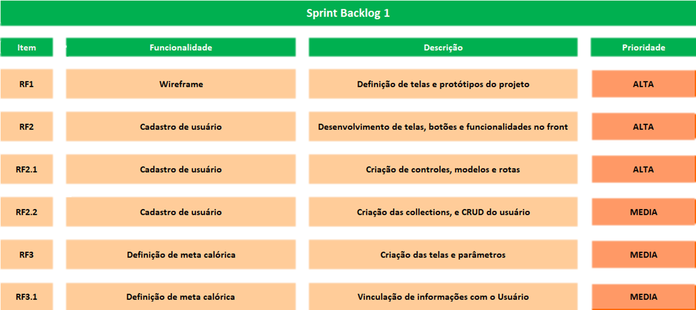
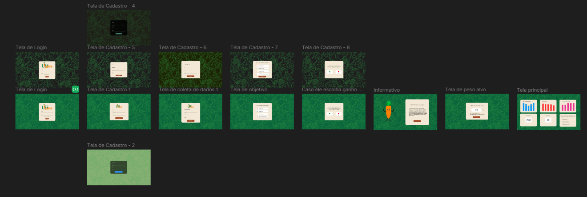
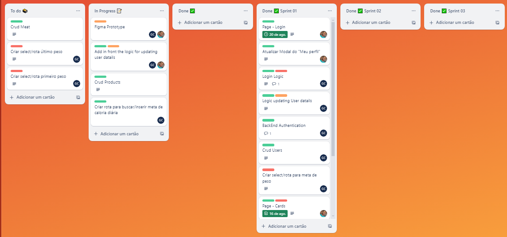

 

🔰 Sprint 01 🔰

📅 02/09/2024 à 17/09/24 📅

<h1>

 
<a  href="#dart-objetivo-da-sprint">Objetivo da Sprint</a> | <a  href="#triangular_flag_on_post-sprint-backlog">Backlog da Sprint</a> | <a  href="#page_facing_up-wireframe">Wireframe</a> | <a  href="#clipboard-kanbam-trello">Kanbam</a> | <a  href="#pushpin-apontamentos">Retrospectiva sprint 1</a> | <a  href="#hotsprings-sprint-review">Retrospectiva do projeto
</a>

</h1>

🎬[Video da Primeira Sprint](https://www.youtube.com/watch?v=euX4xCy80wA&feature=youtu.be)

#### [🏠Voltar para home](./README.md)

🎯Objetivo da Sprint

- Os objetivos desta sprint foram centrados na entrega do wireframe ao cliente, distribuição e organização de tarefas de acordo com a expertise de cada membro do grupo e planejamento das próximas entregas de sprints conforme combinao com o cliente.

🚩Sprint Backlog

📉Burndown Sprint 01

##### [🚀 Voltar ao topo](#dart-objetivo-da-sprint)

📄 Wireframe

📋 Kanbam (Trello)

A equipe toda se organizou para estudar e estruturar a disposição do wireframe. Para entregar da melhor forma o wireframe para o cliente, visando a preparação para o site.

<a href="https://trello.com/b/fvAkv25m/grupo-de-4">Acesso ao quadro</a>

##### [🚀 Voltar ao topo ](#dart-objetivo-da-sprint)

♨️ Sprint Review

Após uma reunião abrangente com toda a equipe, realizamos uma análise minuciosa e constatamos que a primeira Sprint foi bem-sucedida em relação às metas estabelecidas. Todos os entregáveis planejados foram efetivamente concluídos. Além disso, conseguimos adiantar determinados aspectos para a segunda Sprint, otimizando assim o processo. A documentação exigida pelo User Story do professor focal point encontra-se em conformidade com os requisitos, mantendo harmonia em relação às expectativas.

No que concerne ao User Story do cliente, embora haja ainda poucos elementos específicos de seu interesse, já estabelecemos a estrutura das páginas, um componente fundamental para o progresso do projeto. Como equipe, chegamos à conclusão de que estamos no caminho certo com relação a esse User Story.

No contexto do User Story do usuário, embora não tenham ocorrido mudanças substanciais, a organização das páginas representa uma melhoria notável para a experiência do usuário. Uma página bem estruturada e organizada facilitará a incorporação dos elementos visuais no futuro. Portanto, concluímos que estamos adequadamente organizados e alinhados com os objetivos estabelecidos. Nossa intenção é continuar com este método e manter o mesmo nível de comprometimento de toda a equipe, visando atender plenamente às expectativas deste projeto. Se percebermos a necessidade de ajustes, estaremos prontos para efetuá-los, visando uma entrega ainda mais precisa e aprimorada na sinergia da equipe.

📌 Retrospectiva do projeto

No início da sprint, deparamo-nos com um desafio no que concerne à organização das tarefas prioritárias. Cada membro da equipe tinha sua própria perspectiva sobre a sequência de ações a serem tomadas, resultando em pequenos desentendimentos durante as reuniões diárias, que inicialmente acabou resultando num início de sprint mais lento.

Contudo, após uma construtiva conversa com a Product Owner (PO), que possui um vasto conhecimento em relação ao planejamento e à condução de projetos, incluindo a elaboração de wireframes e os passos subsequentes, conseguimos estabelecer uma estrutura mais sólida, de forma que os as tarefas ficaram mais claras e o desenvolvimento da sprint acabar ocorrendo de uma forma mais harmoniosa até sua conclusão.

##### [🚀Voltar ao topo ](#dart-objetivo-da-sprint)