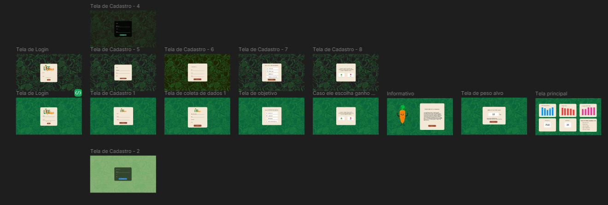

 

🔰 Sprint 02 🔰

📅 17/09/2024 à 08/10/24 📅

<h1>

 
<a  href="#dart-objetivo-da-sprint">Objetivo da Sprint</a> | <a  href="#triangular_flag_on_post-sprint-backlog">Backlog da Sprint</a> | <a  href="#page_facing_up-wireframe">Wireframe</a> | <a  href="#clipboard-kanbam-trello">Kanbam</a> | <a  href="#pushpin-apontamentos">Retrospectiva sprint 1</a> | <a  href="#hotsprings-sprint-review">Retrospectiva do projeto
</a>

</h1>

🎬[Video da Segunda Sprint](https://www.youtube.com/watch?v=euX4xCy80wA&feature=youtu.be)

#### [🏠Voltar para home](./README.md)

🎯Objetivo da Sprint

Nesta segunda sprint, demos início ao desenvolvimento do sistema de cálculo de calorias, avançando significativamente nos objetivos traçados. As principais realizações desta fase foram:

Entrega do Wireframe: Após ajustes finais, o wireframe foi entregue ao cliente, oferecendo uma visão clara da interface e das funcionalidades planejadas. Esta entrega foi essencial para alinhar as expectativas e definir o direcionamento do desenvolvimento.

Início do Desenvolvimento: Com o feedback do cliente sobre o wireframe, iniciamos o desenvolvimento do sistema. A equipe começou a implementar as funcionalidades principais, como a lógica de cálculo de calorias, a interface de entrada de dados dos usuários e a conexão com a base de dados nutricionais. Também houve progresso na estruturação do backend e na integração inicial de APIs para cálculo nutricional.

Distribuição e Organização das Tarefas: Continuamos a distribuir as tarefas com base nas especializações da equipe, com programadores focando em diferentes camadas do sistema: frontend, backend e testes de integração. Esse processo garantiu que o desenvolvimento ocorresse de maneira fluida e eficiente.

🚩Sprint Backlog

📉Burndown Sprint 02

##### [🚀 Voltar ao topo](#dart-objetivo-da-sprint)

📄 Wireframe

📋 Kanbam (Trello)

A equipe toda se organizou para estudar e estruturar a disposição do wireframe. Para entregar da melhor forma o wireframe para o cliente, visando a preparação para o site.

<a href="https://trello.com/b/fvAkv25m/grupo-de-4">Acesso ao quadro</a>

##### [🚀 Voltar ao topo ](#dart-objetivo-da-sprint)

♨️ Sprint Review

Na segunda sprint, a equipe continuou a progredir de acordo com o cronograma planejado para o desenvolvimento do sistema de cálculo de calorias. Os principais objetivos desta sprint foram a implementação de funcionalidades centrais e o aprimoramento da interface, garantindo que o produto continue evoluindo conforme as expectativas.

Principais Conquistas:

Início do Desenvolvimento do Backend: A equipe conseguiu implementar a lógica básica para o cálculo de calorias, integrando dados nutricionais e criando a estrutura de perfis de usuários, que permitirá uma personalização dos resultados conforme as metas individuais.

Progresso no Frontend: O design das primeiras páginas funcionais foi concluído, o que incluiu a criação de uma interface limpa e intuitiva para que os usuários possam inserir seus dados nutricionais e de atividades físicas. A equipe conseguiu finalizar a estrutura das páginas principais do sistema, alinhando-se com o User Story do cliente.

Ajustes na Documentação: A documentação foi atualizada para refletir as alterações feitas no sistema, especialmente as novas APIs integradas. Isso mantém a equipe alinhada com os requisitos do professor focal point e garante que os futuros desenvolvedores possam acompanhar o projeto de forma clara.

Testes Iniciais de Integração: Foram realizados os primeiros testes de integração entre o frontend e o backend, garantindo que a entrada de dados e o cálculo de calorias funcionem de maneira fluida. Embora ainda haja alguns ajustes a serem feitos, os testes iniciais foram bem-sucedidos.

Desafios Enfrentados:

Apesar dos avanços, enfrentamos alguns desafios relacionados à integração de uma API externa para dados nutricionais. Embora o problema tenha sido identificado rapidamente, ainda estamos trabalhando em uma solução eficaz para garantir a precisão dos dados e melhorar o desempenho.

Próximos Passos:

A equipe planeja continuar a implementação das funcionalidades de cálculo de calorias e personalização, além de finalizar o sistema de login para usuários. Também estamos programando uma revisão com o cliente na próxima sprint para apresentar o progresso e validar as próximas etapas de desenvolvimento.

A equipe segue motivada e alinhada com os objetivos do projeto, mantendo uma comunicação constante e uma divisão clara de responsabilidades.

📌 Retrospectiva do projeto

A segunda sprint começou com alguns desafios relacionados à priorização das tarefas. A equipe apresentou diferentes perspectivas sobre a melhor sequência de execução, o que gerou um certo desalinhamento nas reuniões diárias e causou um ritmo inicial mais lento do que o esperado.

Após identificar essa dificuldade, a equipe convocou uma reunião com o Product Owner (PO), que ajudou a esclarecer os objetivos centrais e redefinir o foco das atividades. Com sua experiência em planejamento e organização de projetos, o PO orientou a equipe na criação de um cronograma mais coeso, permitindo que as tarefas fossem reorganizadas de maneira eficiente e prática.

Com uma nova estrutura de prioridades e uma visão clara das metas da sprint, a equipe conseguiu recuperar o ritmo e realizar as entregas conforme o planejado. As discussões diárias tornaram-se mais fluidas, e o trabalho colaborativo evoluiu, permitindo que todos seguissem a mesma direção até o fim da sprint.

O aprendizado dessa experiência foi importante para reforçar a comunicação e garantir que futuras sprints sejam mais ágeis e bem organizadas, mantendo a equipe alinhada desde o início.

##### [🚀Voltar ao topo ](#dart-objetivo-da-sprint)